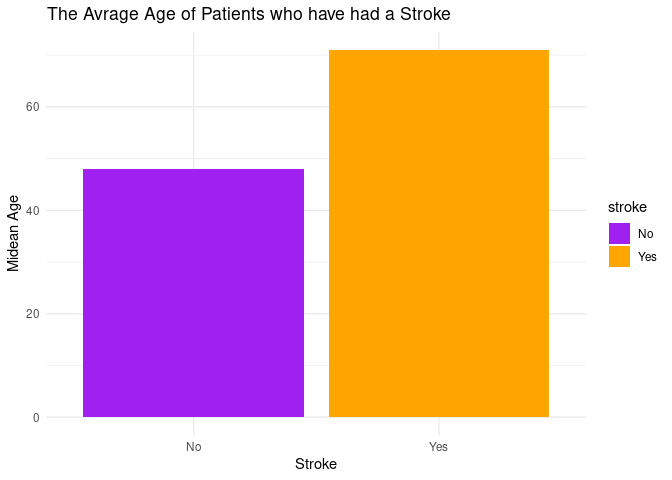

Project tests
================
Piping Hot

``` r
library(tidyverse)
library(broom)
library(janitor)
```

``` {proposal-stuff}
stroke_risk %>%
  filter(smoking_status != "Unknown") %>%
  count(smoking_status, stroke) %>%
  ggplot(aes(x = stroke, y = n, fill = smoking_status)) +
  geom_col(position = "fill") +
  scale_fill_viridis_d() +
  labs(x = "Stroke", y = "Proportion", fill = "Smoking status") +
  theme_minimal()
```

``` {propsal-stuff2}
stroke_risk %>%
  count(gender, stroke) %>%
  filter(gender != "Other")
```

``` r
stroke_risk <- read.csv(here::here("data/healthcare-dataset-stroke-data.csv"))
stroke_risk <- stroke_risk %>%
  filter(age >= 16) %>%
  mutate(
    #hypertension = if_else(hypertension == 1, TRUE, FALSE),
    #heart_disease = if_else(heart_disease == 1, TRUE, FALSE),
    #stroke = if_else(stroke == 1, TRUE, FALSE),
    bmi = if_else(bmi == "N/A", NA_real_, as.numeric(bmi)),
    work_type = if_else(work_type == "children", "Never_worked", work_type)
  ) %>%
clean_names()
glimpse(stroke_risk)
```

    ## Rows: 4,366
    ## Columns: 12
    ## $ id                <int> 9046, 51676, 31112, 60182, 1665, 56669, 53882, 10434…
    ## $ gender            <chr> "Male", "Female", "Male", "Female", "Female", "Male"…
    ## $ age               <dbl> 67, 61, 80, 49, 79, 81, 74, 69, 59, 78, 81, 61, 54, …
    ## $ hypertension      <int> 0, 0, 0, 0, 1, 0, 1, 0, 0, 0, 1, 0, 0, 0, 0, 1, 0, 1…
    ## $ heart_disease     <int> 1, 0, 1, 0, 0, 0, 1, 0, 0, 0, 0, 1, 0, 1, 1, 0, 1, 0…
    ## $ ever_married      <chr> "Yes", "Yes", "Yes", "Yes", "Yes", "Yes", "Yes", "No…
    ## $ work_type         <chr> "Private", "Self-employed", "Private", "Private", "S…
    ## $ residence_type    <chr> "Urban", "Rural", "Rural", "Urban", "Rural", "Urban"…
    ## $ avg_glucose_level <dbl> 228.69, 202.21, 105.92, 171.23, 174.12, 186.21, 70.0…
    ## $ bmi               <dbl> 36.6, NA, 32.5, 34.4, 24.0, 29.0, 27.4, 22.8, NA, 24…
    ## $ smoking_status    <chr> "formerly smoked", "never smoked", "never smoked", "…
    ## $ stroke            <int> 1, 1, 1, 1, 1, 1, 1, 1, 1, 1, 1, 1, 1, 1, 1, 1, 1, 1…

``` r
stroke_risk %>%
  mutate(stroke = if_else(stroke == 1, "Yes", "No"), stroke = fct_rev(stroke)) %>%
  ggplot(aes(x = avg_glucose_level, fill = stroke)) +
  geom_density(alpha = 0.5) +
  labs(
    x = "Average Glucose Level",
    y = "Density",
    title = "Average glucose level compared to stroke risk",
    fill = "Stroke"
  ) +
  scale_fill_viridis_d() +
  theme_minimal()
```

<!-- -->

``` r
 median_age_stroke <- stroke_risk %>%
  mutate( stroke = if_else(stroke == "1", "Yes", "No")) %>%
  group_by(stroke) %>%
  summarise(median_age = median(age))

median_age_stroke %>%
  ggplot(aes(stroke, median_age, fill = stroke)) +
  geom_col() +
  scale_fill_manual(values = c("Purple", "Orange")) +
  labs(x = "Stroke", y = "Midean Age", title = "The Avrage Age of Patients who have had a Stroke") +
  theme_minimal() 
```

<!-- -->
