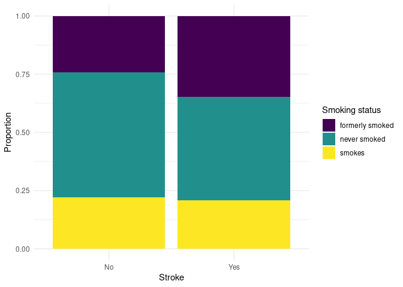

Project proposal
================
Piping Hot

``` r
library(tidyverse)
library(broom)
library(here)
library(ggridges)
```

## 1. Introduction

Do factors such as age, hypertension and BMI increase the risk of a
stroke?

We got our dataset from the Kaggle website. The data was collected
confidentially because it concerns health so the details about its
collection have not been published. Each case is a different individual.
The 12 variables refer to the attributes of the individuals.

## 2. Data

``` r
stroke_risk <- read.csv(here::here("data/healthcare-dataset-stroke-data.csv"))

stroke_risk <- stroke_risk %>%
  mutate(stroke = if_else(stroke == "1", "Yes", "No"))

glimpse(stroke_risk)
```

    ## Rows: 5,110
    ## Columns: 12
    ## $ id                <int> 9046, 51676, 31112, 60182, 1665, 56669, 53882, 10434…
    ## $ gender            <chr> "Male", "Female", "Male", "Female", "Female", "Male"…
    ## $ age               <dbl> 67, 61, 80, 49, 79, 81, 74, 69, 59, 78, 81, 61, 54, …
    ## $ hypertension      <int> 0, 0, 0, 0, 1, 0, 1, 0, 0, 0, 1, 0, 0, 0, 0, 1, 0, 1…
    ## $ heart_disease     <int> 1, 0, 1, 0, 0, 0, 1, 0, 0, 0, 0, 1, 0, 1, 1, 0, 1, 0…
    ## $ ever_married      <chr> "Yes", "Yes", "Yes", "Yes", "Yes", "Yes", "Yes", "No…
    ## $ work_type         <chr> "Private", "Self-employed", "Private", "Private", "S…
    ## $ Residence_type    <chr> "Urban", "Rural", "Rural", "Urban", "Rural", "Urban"…
    ## $ avg_glucose_level <dbl> 228.69, 202.21, 105.92, 171.23, 174.12, 186.21, 70.0…
    ## $ bmi               <chr> "36.6", "N/A", "32.5", "34.4", "24", "29", "27.4", "…
    ## $ smoking_status    <chr> "formerly smoked", "never smoked", "never smoked", "…
    ## $ stroke            <chr> "Yes", "Yes", "Yes", "Yes", "Yes", "Yes", "Yes", "Ye…

## 3. Data analysis plan

Is stroke risk affected by

``` r
stroke_risk %>%
  filter(smoking_status != "Unknown") %>%
  count(smoking_status, stroke) %>%
  ggplot(aes(x = stroke, y = n, fill = smoking_status)) +
  geom_col(position = "fill") +
  scale_fill_viridis_d()
```

<!-- -->

``` r
stroke_risk %>%
  count(gender, stroke) %>%
  filter(gender != "Other")
```

    ##   gender stroke    n
    ## 1 Female     No 2853
    ## 2 Female    Yes  141
    ## 3   Male     No 2007
    ## 4   Male    Yes  108

The outcome (response, Y) and predictor (explanatory, X) variables you
will use to answer your question. The comparison groups you will use, if
applicable. The statistical method(s) that you believe will be useful in
answering your question(s). (You can update these later as you work on
your project.) What results from these specific statistical methods are
needed to support your hypothesized answer?
